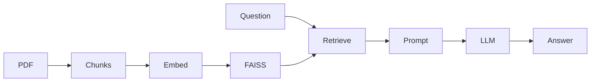

# RAG Document Chatbot

A small app to chat with a PDF. You upload a document, it builds a search index
over the text, and you can ask questions about it. Answers come only from the
document and show which pages they came from.

Live demo: https://rag-document-chatbot-ltqqdpapp2wjxmxfkhsvyvz.streamlit.app

I built this to learn how retrieval-augmented generation (RAG) works end to end:
chunking, embeddings, a vector store, and prompting an LLM with the retrieved
context.

## What it does

- Reads a PDF and splits it into overlapping chunks.
- Embeds the chunks and stores them in a FAISS index.
- For each question, finds the most relevant chunks and passes them to the LLM.
- If the answer is not in the document, it says so instead of making something up.



By default it runs for free: embeddings run locally (sentence-transformers) and
the LLM is a free hosted model on Hugging Face. You can switch to OpenAI from the
sidebar if you have a key.

## Run it locally

```bash
git clone https://github.com/Kirill-Streltsov/rag-document-chatbot.git
cd rag-document-chatbot

python3.12 -m venv .venv && source .venv/bin/activate
pip install -r requirements.txt

# free token for the hosted LLM: https://huggingface.co/settings/tokens
export HF_TOKEN=hf_xxxxxxxx

streamlit run app.py
```

Then open http://localhost:8501, upload a PDF (there is a sample one in
`sample_docs/`), click "Build index" and start asking.

With Docker:

```bash
docker build -t rag-chatbot .
docker run -p 8501:8501 -e HF_TOKEN=hf_xxxxxxxx rag-chatbot
```

## Tests

```bash
pip install -r requirements-dev.txt
pytest
```

The tests use fake models, so they run without any API keys.

## Layout

```
app.py            Streamlit UI
ragchat/          the pipeline: config, ingest, embeddings, llm, chain
scripts/          sample PDF generator + a small retrieval experiment
tests/            unit tests
```

There are some notes on how I picked the chunk size and number of retrieved
chunks in `docs/EXPERIMENTS.md`.
